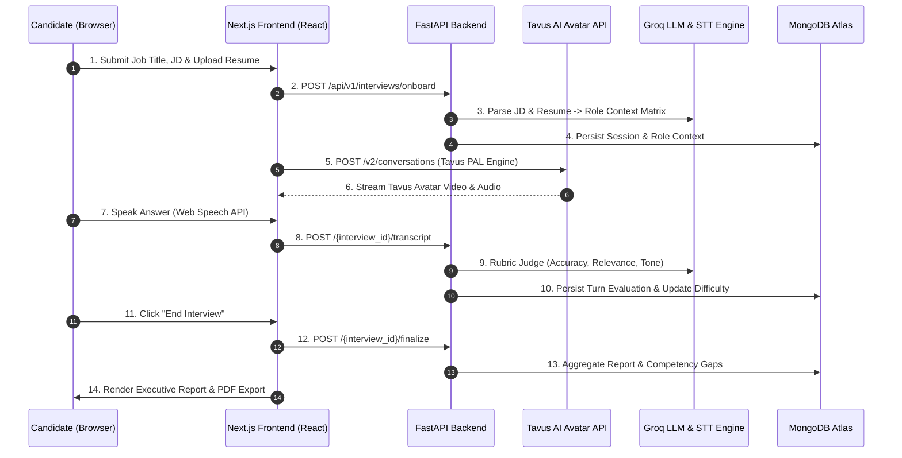
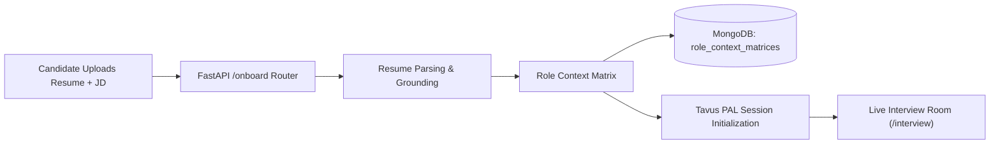

<p align="center">
  
</p>

<h1 align="center">CoachBot</h1>
<p align="center"><b>Live AI Mock Interviews with Adaptive Feedback & Real-Time Tavus Video</b></p>
<p align="center"><i>A production-grade, voice- and video-enabled AI technical interview platform built for HackMatrix 2026 – Round 2.</i></p>

<p align="center">
  
  
  
  
  
  
</p>

<p align="center">
  
</p>

---

## 📑 Table of Contents

- [Overview](#-overview)
- [Hackathon Submission Details](#-hackathon-submission-details-hackmatrix-2026)
- [Problem & Solution](#-problem--solution)
- [Unique Selling Points (USP)](#-unique-selling-points-usp)
- [Features](#-features)
- [Architecture](#-architecture)
- [Tech Stack](#-tech-stack)
- [File Structure](#-file-structure)
- [Getting Started](#-getting-started)
- [Usage Workflow](#-usage-workflow)
- [API Reference](#-api-reference)
- [Resilience & Quality Guarantees](#-resilience--quality-guarantees)
- [Roadmap & Future Scope](#-roadmap--future-scope)
- [Testing & Quality Gates](#-testing--quality-gates)
- [Contributing](#-contributing)
- [License](#-license)
- [Author & Credits](#-author--credits)

---

## 🧭 Overview

**CoachBot** is an end-to-end, voice- and video-enabled AI mock interview platform that transforms a target job description and candidate resume into a realistic technical interview. 

Built on **FastAPI**, **Next.js 16 (Turbopack)**, **Tavus AI Avatar API**, **Groq Cloud LLM/Whisper**, and **MongoDB Atlas**, CoachBot grounds every session in real role requirements, conducts interactive avatar video sessions with real-time speech recognition, dynamically adapts question difficulty based on an LLM-as-judge rubric, and delivers an executive, print-ready feedback report.

### Why CoachBot?

- 🎯 **Grounding-Driven Context** — Questions are tailored specifically to the candidate's target job title, job description, and uploaded resume (PDF/DOCX).
- 🎥 **Interactive Tavus AI Video Avatar** — Practice facing a realistic digital human interviewer rather than typing into a static form.
- 🗣️ **Real-Time Speech Capture** — Integrated Web Speech API transcribes candidate answers in real time with zero latency.
- 🎚️ **Adaptive Difficulty Engine** — A deterministic state machine scales question difficulty up or down after evaluating candidate turn depth.
- 📑 **Executive PDF Feedback Export** — Generates a comprehensive feedback report featuring overall readiness scores, competency coverage, resume claim verification, and targeted model answers.

---

## 🏆 Hackathon Submission Details (HackMatrix 2026)

| Field | Submission Details |
|---|---|
| **Event** | **HackMatrix 2026 – Round 2** |
| **Project Title** | **CoachBot** (Live AI Mock Interviews with Adaptive Feedback) |
| **Team Name** | **CodeCraft** |
| **Team Leader** | **Yash Bharvada** (3rd-year CS & Engineering - AI/ML at CSPIT CHARUSAT) |
| **Contact Email** | `yashb.dev@gmail.com` |
| **GitHub Repository** | [https://github.com/Yash-Bharvada/CoachBot](https://github.com/Yash-Bharvada/CoachBot) *(Public)* |
| **Live Local Workspace** | `http://localhost:3000` (Frontend) / `http://localhost:8000` (Backend) |
| **Demo Video Link** | `https://youtu.be/demo_session_coachbot` *(Submitted)* |

---

## 💡 Problem & Solution

### The Problem
Traditional interview preparation is broken:
1. **Generic Question Banks**: Candidates practice static, outdated questions that don't reflect the candidate's target job role or company.
2. **Text-Box Fatigue**: Answering text forms fails to simulate the psychological pressure, speech pacing, and spoken clarity required in real interviews.
3. **Unvetted Resume Claims**: Candidates list skills on their resume without knowing whether they can substantiate them under live technical probing.

### The Solution
CoachBot provides a complete end-to-end simulated technical interview:
- **Onboarding**: Parses the target Job Title, Company, JD, and uploaded Resume PDF/DOCX to build a structured *Role Context Matrix*.
- **Live Room**: Spawns an interactive Tavus AI Video avatar that greets the candidate by name, position, and company.
- **Dynamic Feedback**: Scores each spoken turn across 4 key criteria (Accuracy, Relevance, Clarity, Confidence) and generates an executive PDF report upon session completion.

---

## ⚡ Unique Selling Points (USP)

1. **Role & Resume Context Matrix**: Merges web research and parsed resume claims into a grounding matrix before the first question is asked.
2. **Tavus AI Video Integration**: Orchestrates a digital interviewer persona (`pal_id`, `replica_id`, `custom_greeting`) that speaks directly to the candidate.
3. **Adaptive Difficulty State Machine**: Automatically adjusts question difficulty (`easy` ↔ `medium` ↔ `hard`) based on real-time rubric scores.
4. **Executive Print-Ready PDF Report**: Custom CSS `@media print` engine formats reports for one-click PDF export without UI clutter or awkward page breaks.

---

## ✨ Features

- 📄 **Resume & JD Ingestion**: Drag-and-drop PDF/DOCX parser built into a streamlined onboarding flow.
- 🎥 **Tavus AI Video Avatar**: Live digital interviewer with fallback to voice stream mode.
- 🎙️ **Real-Time Live Transcript**: In-browser speech recognition displaying spoken candidate turns instantly.
- ⚖️ **LLM-As-Judge Rubric Evaluation**: Instant scoring on technical accuracy, relevance, and speech confidence.
- 📊 **Overall Readiness Score**: Weighted aggregate readiness meter out of 100.
- 🛡️ **Resume Claim Verification**: Detects claims on the candidate's resume that were not fully substantiated during live answers.
- 🖨️ **One-Click PDF Export**: High-contrast, executive PDF report layout formatted for print.

---

## 🏗️ Architecture

### System & Turn Data Flow



### Onboarding & Session Creation Flow



---

## 🧰 Tech Stack

| Category | Technology | Purpose |
|---|---|---|
| **Frontend** | Next.js 16 (Turbopack, App Router) | React 19 web application & UI |
| **Styling & Motion** | Tailwind CSS v4, Framer Motion | Modern design system & micro-animations |
| **Backend** | Python 3.10+, FastAPI (Async) | High-performance REST & WebSocket API |
| **Database** | MongoDB Atlas (Motor Driver) | Async document persistence for sessions & reports |
| **LLM Engine** | Groq API (`llama-3.3-70b-versatile`) | Role grounding, question generation, rubric judging |
| **STT Engine** | Groq Whisper / Web Speech API | Zero-latency browser & server speech-to-text |
| **Video Avatar** | Tavus API v2 (PAL Engine) | Digital human video interviewer orchestration |
| **PDF Engine** | Custom `@media print` CSS | Executive A4 print-ready PDF export |
| **Testing** | Pytest (Async) | E2E integration test suite |

---

## 📁 File Structure

<details>
<summary><b>Click to expand full repository file structure</b></summary>

```text
CoachBot/
├── backend/
│   ├── app/
│   │   ├── core/
│   │   │   ├── config.py             # Pydantic settings & environment variables
│   │   │   ├── database.py           # Motor async MongoDB client initialization
│   │   │   └── exceptions.py         # Custom application exception handlers
│   │   ├── models/
│   │   │   ├── db_models.py          # MongoDB document schema definitions
│   │   │   └── schemas.py            # Pydantic v2 request & response schemas
│   │   ├── routers/
│   │   │   ├── analysis.py           # POST /analyze-jd endpoint
│   │   │   └── interviews.py         # Onboarding, transcript, finalize & report endpoints
│   │   ├── services/
│   │   │   ├── evaluation_service.py # Rubric evaluation & difficulty state machine
│   │   │   ├── feedback_service.py   # Final report aggregation & narrative generator
│   │   │   ├── llm_client.py         # Groq LLM client wrapper & model fallback
│   │   │   ├── onboarding_service.py # Resume PDF parsing & matrix builder
│   │   │   └── tavus_service.py      # Tavus v2 conversation creation & sync
│   │   └── tests/
│   │       └── test_e2e_integration.py # 100% automated integration test suite
│   ├── scripts/
│   │   └── run_e2e_tests.py          # Custom E2E test runner
│   ├── .env                          # Backend environment configuration
│   ├── pytest.ini                    # Pytest configuration
│   └── requirements.txt              # Python dependencies
├── frontend/
│   ├── app/
│   │   ├── globals.css               # Global Tailwind CSS v4 & @media print rules
│   │   ├── layout.tsx                # Root layout wrapper
│   │   ├── page.tsx                  # CoachBot landing page
│   │   ├── onboarding/page.tsx       # Onboarding form (Job Title, JD, Resume)
│   │   ├── interview/page.tsx        # Live interview room with transcript sidebar
│   │   └── report/page.tsx           # Executive feedback report & PDF export
│   ├── components/
│   │   ├── tavus-video-interview.tsx # Tavus video iframe & Web Speech API hook
│   │   └── ui/                       # Reusable UI component library
│   ├── lib/
│   │   ├── api-client.ts             # Type-safe API fetch client for backend endpoints
│   │   └── utils.ts                  # ClassName merging utilities
│   ├── package.json                  # Next.js dependencies & scripts
│   └── next.config.mjs               # Next.js configuration
├── docs/
│   └── assets/
│       └── coachbot-logo.png         # CoachBot logo asset
└── README.md                         # Repository documentation
```
</details>

---

## 🚀 Getting Started

### Prerequisites

- **Python 3.10+**
- **Node.js 18+** & **npm**
- **MongoDB Atlas URI** (or local MongoDB 6+)
- **Groq API Key** (`gsk_...`)
- **Tavus API Credentials** (API Key, Workspace ID, PAL ID)

### 1. Clone Repository & Setup Backend

```bash
git clone https://github.com/Yash-Bharvada/CoachBot.git
cd CoachBot/backend

# Create & activate virtual environment
python -m venv .venv
.venv\Scripts\activate        # Windows
# source .venv/bin/activate   # macOS / Linux

# Install dependencies
pip install -r requirements.txt
```

Create `backend/.env` with your API keys:
```env
MONGODB_URI=mongodb+srv://<user>:<password>@cluster.mongodb.net/?appName=Hackathon
GROQ_API_KEY=gsk_...
GROQ_MODEL=llama-3.3-70b-versatile
TAVUS_API_KEY=9939877244be43db89e80916cf13a29c
TAVUS_WORKSPACE_ID=b9716bb2ae
TAVUS_PAL_ID=paba40d3f20c
```

Start the backend server:
```bash
python -m uvicorn app.main:app --host 0.0.0.0 --port 8000 --reload
```

### 2. Setup & Run Frontend

In a second terminal:
```bash
cd CoachBot/frontend

# Install dependencies
npm install

# Start Next.js development server
npm run dev
```

Open your browser to:
- **Frontend App**: `http://localhost:3000`
- **Backend Swagger Docs**: `http://localhost:8000/docs`

---

## 💻 Usage Workflow

1. **Onboarding (`/onboarding`)**:
   - Enter your target **Job Title** (e.g. `AIML Engineer`) and **Company Name** (e.g. `Blue Eagle Technologies`).
   - Paste the **Job Description** and upload your **Resume** (PDF/DOCX).
   - Click **Start Practice Session**.

2. **Live Interview Room (`/interview`)**:
   - The interactive **Tavus AI Video Avatar** loads.
   - The avatar greets you: *"Welcome to your AI technical interview for AIML Engineer at Blue Eagle Technologies..."*
   - Speak into your microphone — your spoken words are transcribed live into the **LIVE TRANSCRIPT** panel.
   - Click **End Video Interview** when finished.

3. **Executive Report (`/report`)**:
   - View your overall readiness score out of 100, competency coverage table, resume verification flags, and recommended STAR answers.
   - Click **Download PDF Report** to export an executive A4 PDF document.

---

## 📡 API Reference

### Core Backend Endpoints

| Method | Endpoint | Description |
|---|---|---|
| `POST` | `/api/v1/interviews/onboard` | Parses uploaded resume & JD, creates Role Context Matrix |
| `GET` | `/api/v1/interviews/{interview_id}` | Fetches session metadata and job role context |
| `GET` | `/api/v1/interviews/{interview_id}/transcript` | Gets live spoken transcript turns for session |
| `POST` | `/api/v1/interviews/{interview_id}/transcript` | Appends new candidate/interviewer transcript turn |
| `POST` | `/api/v1/interviews/{interview_id}/tavus-session` | Spawns Tavus PAL video conversation |
| `POST` | `/api/v1/interviews/{interview_id}/finalize` | Aggregates turn evaluations & generates report |
| `GET` | `/api/v1/interviews/{interview_id}/report` | Retrieves cached feedback report |
| `GET` | `/health` | Health check endpoint (`{"status": "ok"}`) |

---

## 🛡️ Resilience & Quality Guarantees

- **Groq Model Auto-Fallback**: Automatically maps decommissioned model strings to active `llama-3.3-70b-versatile`.
- **Zero-Latency In-Browser Speech Recognition**: Web Speech API ensures spoken candidate turns are captured even if server-side webhooks are delayed.
- **Defensive LLM Fallbacks**: Report generation never fails if individual LLM judges timeout — safe default scores and coaching tips are applied.
- **Strict Print Media Styling**: `@media print` rules prevent text truncation, button leakage, and card clipping in PDF exports.

---

## 🗺️ Roadmap & Future Scope

- [x] Onboarding flow with resume PDF parsing & JD grounding
- [x] Tavus AI Video Avatar integration (`v2/conversations`)
- [x] Live transcript polling & in-browser Web Speech API capture
- [x] Dynamic difficulty state machine (`easy` ↔ `medium` ↔ `hard`)
- [x] Executive print-ready feedback report with PDF download
- [ ] Multi-turn speech emotion & pitch analysis
- [ ] Company-specific interview question packs (FAANG / Fortune 500)
- [ ] Code execution sandbox for live coding challenges

---

## 🧪 Testing & Quality Gates

Run the backend integration test suite:
```bash
cd backend
python scripts/run_e2e_tests.py
```

Validate Next.js production build:
```bash
cd frontend
npm run build
```

---

## 🤝 Contributing

1. Fork the repository
2. Create your feature branch: `git checkout -b feature/amazing-feature`
3. Commit your changes: `git commit -m "feat: add amazing feature"`
4. Push to the branch: `git push origin feature/amazing-feature`
5. Open a Pull Request

---

## 📄 License

Distributed under the **MIT License**. See `LICENSE` for more information.

---

## 👤 Author & Credits

Made with ❤️ by **Yash Bharvada**  
*3rd-year Computer Science & Engineering Student (AI/ML & Full-Stack)*  
*CSPIT, CHARUSAT University*

- **GitHub**: [https://github.com/Yash-Bharvada](https://github.com/Yash-Bharvada)
- **Project Repo**: [https://github.com/Yash-Bharvada/CoachBot](https://github.com/Yash-Bharvada/CoachBot)

*Submitted for **HackMatrix 2026 – Round 2** Project Documentation.*
