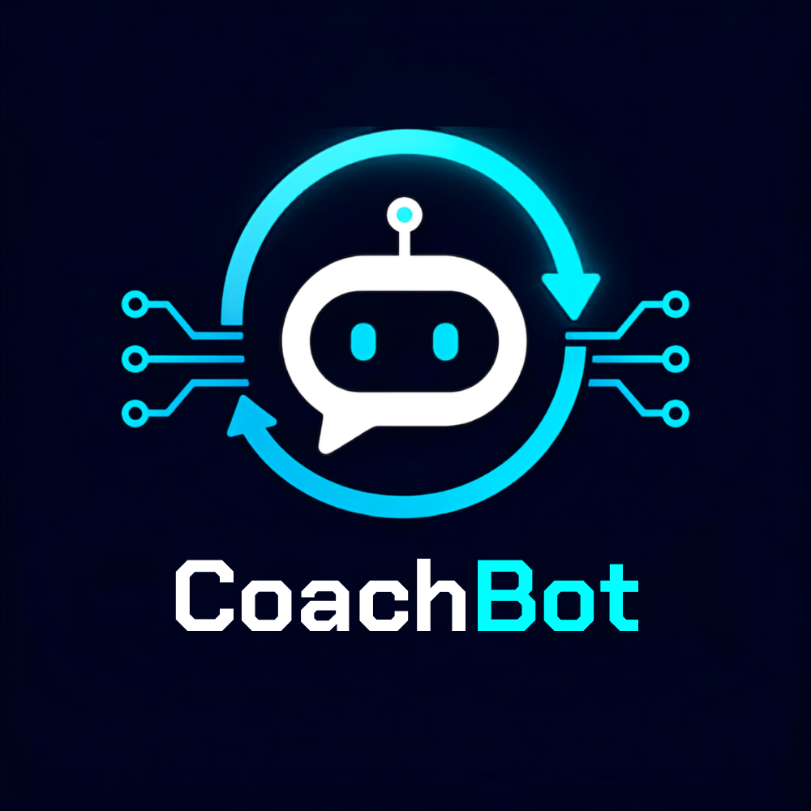

<p align="center">
  
</p>

<h1 align="center">CoachBot</h1>
<p align="center"><b>Live AI Mock Interviews with Adaptive Feedback & Real-Time Tavus Video</b></p>

<p align="center">
  
  
  
  
</p>

---

## 🧭 Overview

**CoachBot** is a real-time, voice-enabled AI mock interview platform built on **FastAPI**, **Next.js**, **Tavus AI**, and **MongoDB**.
It grounds the interview in your target role and resume, streams audio bidirectionally over a single WebSocket, conducts live interactive video sessions via Tavus AI, scores every answer against a fixed rubric, and delivers an executive feedback report.

```
/app
  main.py                          # FastAPI app factory, lifespan, router registration
  /routers
    analysis.py                    # POST /api/v1/interviews/analyze-jd
    interviews.py                  # GET /{id}, POST /{id}/finalize, GET /{id}/report
    stream.py                      # WS  /api/v1/interviews/{id}/stream
  /services
    llm_client.py                  # Async Groq LLM + Whisper STT (timeouts + retries)
    web_grounding_service.py       # DuckDuckGo / Tavily live role research
    jd_analysis_service.py         # Module 1: JD parse → grounding → Role Context Matrix
    evaluation_service.py          # Module 3: rubric judge + difficulty state machine
    tts_service.py                 # Edge-TTS / ElevenLabs / HF streaming TTS
    voice_pipeline_service.py      # Module 2: STT → LLM → TTS orchestrator
    feedback_service.py            # Module 4: aggregation → sentiment → weak points
  /models
    schemas.py                     # All Pydantic v2 request/response models (OpenAPI)
    db_models.py                   # TypedDict mirrors of the 4 Mongo collections
  /core
    config.py                      # pydantic-settings from .env / env vars
    database.py                    # motor client + get_database dependency
    exceptions.py                  # AppException hierarchy + HTTP + WS handlers
    security.py                    # slowapi rate limiting for HTTP + WS handshakes
  /websockets
    connection_manager.py          # In-memory sessions, reconnect grace, checkpointing
  /tests
    conftest.py                    # Async fixtures, LLM/STT/TTS/grounding mocks
    test_analysis.py               # Module 1: /analyze-jd happy path + edge cases
    test_evaluation.py             # Module 3: difficulty state machine + 3 sample answers
    test_stream_and_reports.py     # Module 2 + 4: WS text flow + /finalize + cached report
requirements.txt
.env.example
README.md
```

## Getting Started

### Prerequisites

* **Python 3.11+**
* **MongoDB 6+** running locally on `mongodb://localhost:27017` (or set `MONGO_URI`)
* A **Groq API key** (used for LLM + Whisper STT)

TTS defaults to the free, zero-key Edge-TTS provider.  Set `TTS_PROVIDER=elevenlabs`
(plus `ELEVENLABS_API_KEY`) for higher-quality voice output.  Web grounding
defaults to DuckDuckGo HTML search; upgrade to Tavily with `WEB_GROUNDING_PROVIDER=tavily`
and `TAVILY_API_KEY`.

### Install

```bash
python -m venv .venv
.venv\Scripts\activate        # Windows; source .venv/bin/activate on POSIX
pip install -r requirements.txt
cp .env.example .env
# Edit .env — at minimum set GROQ_API_KEY.
```

### Run

```bash
uvicorn app.main:app --reload --port 8000
```

* OpenAPI docs:  http://localhost:8000/docs
* Redoc:        http://localhost:8000/redoc
* Healthcheck:  http://localhost:8000/health

### Test

Tests monkey-patch LLM/STT/TTS/grounding so **no API keys are required**.
MongoDB is still required locally (skipped automatically if unavailable):

```bash
pytest app/tests -q
```

## API Workflow — Step-by-Step

### 1. Initialize a session — POST `/analyze-jd`

Parse the job description, ground it with live role research, and create a
Role Context Matrix.  The returned `interview_id` anchors every subsequent
call.

```bash
curl -sS -X POST http://localhost:8000/api/v1/interviews/analyze-jd \
  -H 'Content-Type: application/json' \
  -d '{
    "job_title": "Senior Backend Engineer",
    "company_name": "Acme Cloud",
    "job_description": "Senior Python backend engineer, 5+ yrs, async I/O, PostgreSQL, microservices."
  }' | python -m json.tool
```

Typical response:

```json
{
  "interview_id": "intv_a1b2c3d4e5f67890abcd",
  "core_competencies": ["Python", "Async I/O", "PostgreSQL", "System Design", ...],
  "difficulty_baseline": "medium",
  "grounding_summary": "Expect deep dives into async patterns and SQL indexing for this role at Acme Cloud.",
  "grounding_status": "ok"
}
```

If the live grounding call times out the request still returns **201** with
`grounding_status: "degraded"` and uses JD-only extraction.

### 2. Live session — WS `/{interview_id}/stream`

Connect with any WebSocket client (e.g. [`wscat`](https://github.com/websockets/wscat)):

```bash
wscat -c ws://localhost:8000/api/v1/interviews/intv_a1b2c3d4e5f67890abcd/stream
```

**Server sends a greeting first** — listen for frames of type `interviewer_text`
and `audio`, then play the audio.  Send your answer in one of two ways:

**Text frame (dev / test only):**
```json
{"type": "text", "text": "I'd use an asyncio.Queue with bounded workers."}
```

**Chunks of base64 audio (production):**
```json
{"type": "audio", "audio_b64": "Sq1r0KAF...", "codec": "pcm_s16le_16k", "end_of_turn": false}
...
{"type": "audio", "audio_b64": "Sq1r0KAF...", "end_of_turn": true}
```

Server frames back on every turn, in order:

| Frame type        | What it carries                                                                 |
|-------------------|---------------------------------------------------------------------------------|
| `transcript`      | Final STT transcription of the candidate's turn (`is_final: true`).             |
| `interviewer_text`| Text version of the question about to be spoken.                                |
| `audio`           | Base64 MP3 chunks (`chunk_index` for ordering; final chunk has `is_final`).     |
| `evaluation`      | Structured rubric scores + difficulty_before/difficulty_after for the turn.     |
| `error`           | Structured error — emitted *just before* the socket is closed.                  |

WebSocket close codes the platform uses:

* `1000` – normal completion / client-initiated end.
* `1011` – unexpected server error (an `error` frame precedes this).
* `4000` – idle timeout (>5 min with no traffic).
* `4001` – session abandoned because the reconnect grace period expired.
* `4002` – STT/LLM/TTS pipeline stage failed irrecoverably.

If the connection drops mid-interview **reconnect with the same `interview_id`
within 60 seconds** (configurable via `WEBSOCKET_GRACE_PERIOD_SECONDS`) and
the in-memory transcript + scoring state are restored.

### 3. Finalize — POST `/{interview_id}/finalize`

Generates the structured feedback report and caches it.

```bash
curl -sS -X POST http://localhost:8000/api/v1/interviews/intv_a1b2c3d4e5f67890abcd/finalize \
  | python -m json.tool
```

The report contains:

```json
{
  "interview_id": "...",
  "report": {
    "overall_readiness": 72.4,
    "section_scores": {
      "confidence_and_tone": 78,
      "fluency": 84,
      "technical_accuracy": 68,
      "relevance": 73
    },
    "narrative_summary": "...",
    "weak_points": [
      {
        "turn_index": 2,
        "issue": "Answer lacked a concrete latency trade-off example.",
        "suggested_answer": "A strong answer would walk through alternatives A vs B..."
      }
    ],
    "competency_gaps": ["Distributed caching", "Idempotency keys"],
    "per_turn_scores": {"1": {"relevance": 85, ...}, ...},
    "generated_at": "2026-08-09T12:00:00Z"
  }
}
```

### 4. Retrieve cached report — GET `/{interview_id}/report`

Same payload as `/finalize` but a **free lookup** — no LLM calls.

```bash
curl -sS http://localhost:8000/api/v1/interviews/intv_a1b2c3d4e5f67890abcd/report
```

### 5. Session metadata — GET `/{interview_id}`

Lightweight progress view for the UI:

```bash
curl -sS http://localhost:8000/api/v1/interviews/intv_a1b2c3d4e5f67890abcd
```

## MongoDB Collections

All created with indexes on first application boot.  **Already provisioned**
via the MongoDB MCP server:

| Collection                | Indexes                                                              |
|---------------------------|----------------------------------------------------------------------|
| `role_context_matrices`   | `interview_id` (unique), `created_at`                                |
| `interview_sessions`      | `interview_id` (unique), `status`                                    |
| `turn_evaluations`        | compound unique `(interview_id, turn_index)`                         |
| `feedback_reports`        | `interview_id` (unique)                                              |

## Resilience Guarantees

* **Graceful grounding degradation.**  A slow web search never fails
  `/analyze-jd`; the matrix is persisted with `grounding_status: degraded`.
* **Timeout + single retry + exponential backoff** on every Groq, TTS, and
  grounding call (via `tenacity`).
* **Per-turn voice-pipeline timeout** so a stuck STT never freezes the socket;
  the session survives to the next turn when possible.
* **Reconnect grace window.** Dropped WebSocket connections keep state in the
  `ConnectionManager` for `WEBSOCKET_GRACE_PERIOD_SECONDS` before being
  marked abandoned.  Session state is also check-pointed to Mongo every 10 s.
* **Unbounded buffer guard.**  Client audio > `MAX_AUDIO_BUFFER_MB` triggers
  a structured error and socket close rather than OOMing the process.
* **No silent websocket death.**  Every exception path in the stream handler
  emits a structured `error` frame *before* closing with an explicit code.
* **Structured logging throughout** with interview_id correlation so any turn
  is traceable end-to-end across logs.
* **Rate limiting** on all HTTP POST endpoints and the WS handshake (default
  60/min HTTP, 120/min WS per IP), configurable in `.env`.
